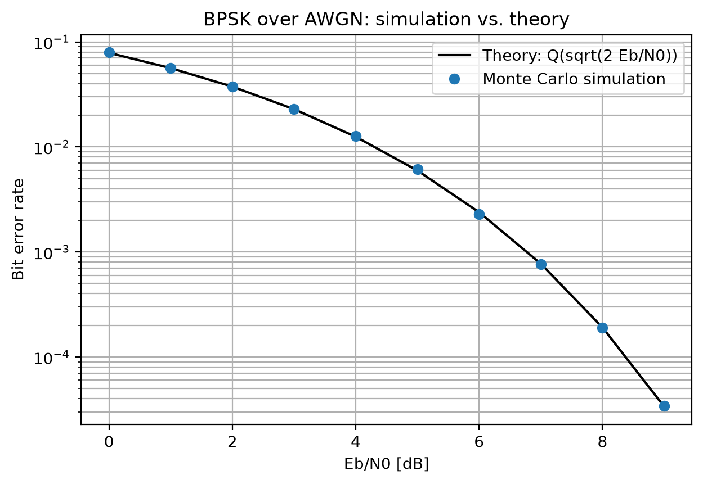
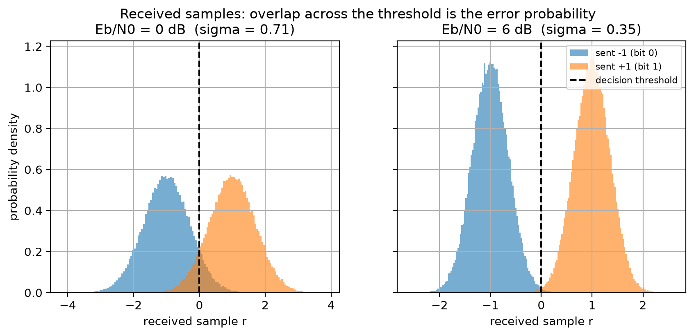
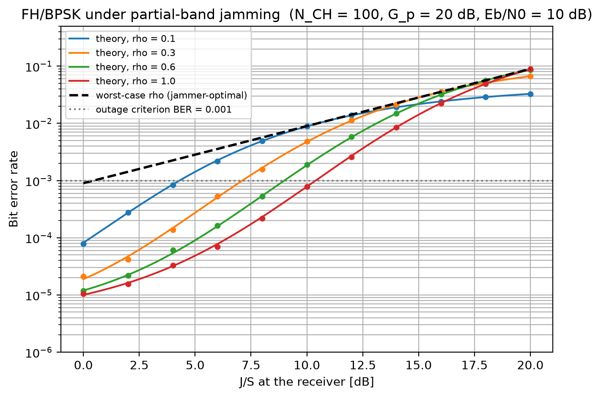
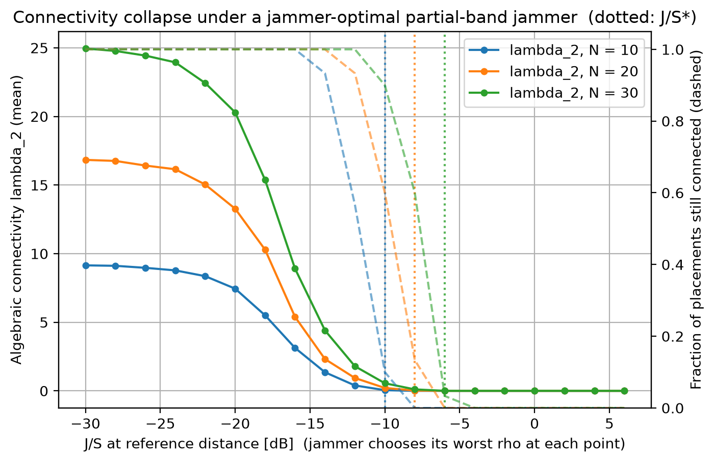
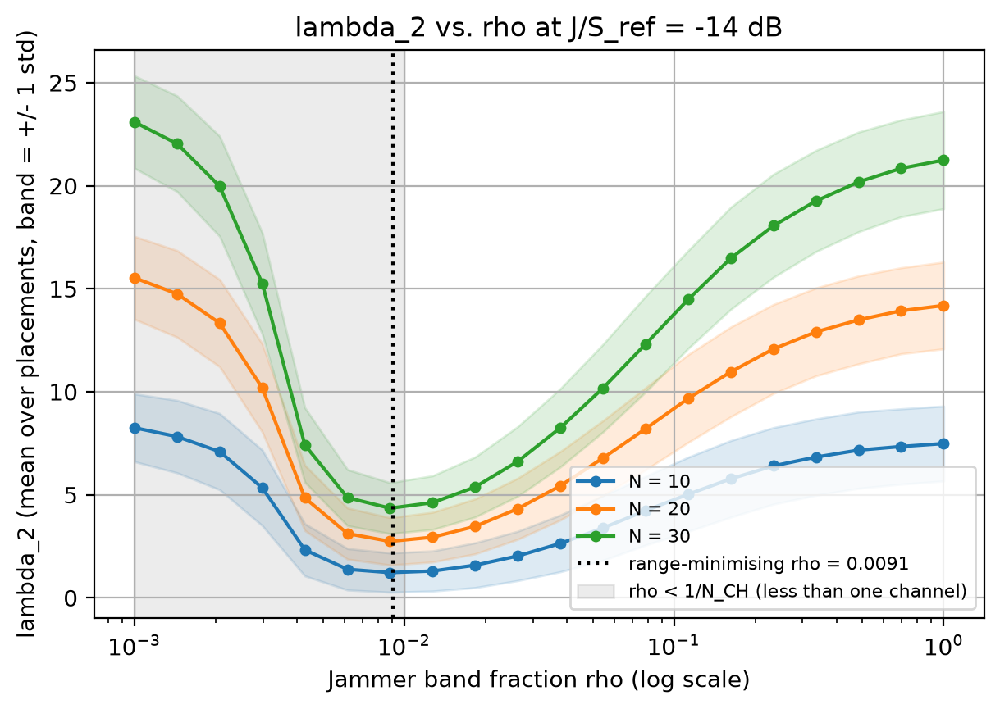
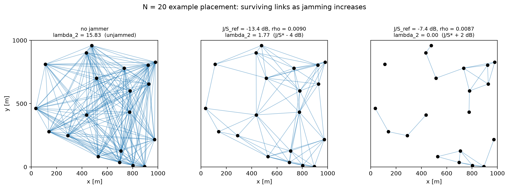

# swarm-network-jamming-sim

Simulation study of how the connectivity of a multi-node frequency-hopping
network degrades under partial-band jamming, measured by the algebraic
connectivity (second-smallest Laplacian eigenvalue, λ₂) of the link graph.

This is a self-directed learning project built in stages. Each stage is
verified against a closed-form result or a known limiting case before the next
stage is started. Nothing here models a specific real-world radio; all physical
parameters are stated as assumptions in the source files.

## Motivation

In a swarm of cooperating nodes, individual links fail as jamming intensifies.
Counting failed links does not tell you whether the network is still one piece.
The Laplacian eigenvalue λ₂ does: it is zero when the graph is disconnected and
grows with the graph's robustness. The question this project asks is

> As a jammer concentrates its power on a fraction ρ of the hopping band,
> at what ρ does λ₂ collapse, and how does that threshold depend on the
> number of nodes and hopping channels?

The chain of models is

```
bit → AWGN → Eb/N0 → BER → hopping → partial-band jamming
    → per-link outage → adjacency matrix → Laplacian → λ₂ → threshold ρ*
```

## Stages

| Stage | Content | Verification | Status |
|------:|---------|--------------|--------|
| S0 | BPSK over AWGN, Monte Carlo BER | Must match Q(√(2Eb/N0)) | **done** (ratio 0.96–1.03 across 0–9 dB) |
| S1 | FH + partial-band jammer, BER vs J/S, jamming margin | Monte Carlo vs closed-form mixture at 44 points; ρ=1 limit; worst-case ρ | **done** (ratio 0.88–1.14; ρ* theory = sim = 0.14) |
| S2 | N-node graph, per-link outage → λ₂ vs ρ and vs J/S | K_N ⇒ λ₂=N; λ₂>0 ⇔ BFS-connected (36,090 graphs, 0 mismatches); Fiedler bound; limits | **done** (J/S* = −10/−8/−6 dB for N = 10/20/30) |
| S3 | Channel re-allocation after detection, λ₂ recovery | Recovery ratio vs. no-jamming baseline | optional |

## Repository layout

```
src/        simulation scripts, one per stage
theory/     derivation notes (LaTeX + PDF), one per stage — see theory/README.md
figures/    generated figures (committed so results are viewable without running)
results/    numeric results (CSV)
environment.yml
```

## Theory notes

Each stage has a short derivation note in [`theory/`](theory/README.md) that
maps the code to the equations and explains what each verification check
proves: the BPSK/AWGN error probability and Monte Carlo statistics (S0), the
jammer's optimal band fraction and the inverse-linear worst-case BER law (S1),
and the Laplacian eigenvalue theorems behind λ₂ including a bound the first
version of the code got wrong (S2).

## Reproducing the results

```bash
conda env create -f environment.yml
conda activate swarm-sim
python src/s0_sinusoid_fft.py
python src/s0_bpsk_awgn_ber.py
python src/s1_fh_partial_band_jamming.py
python src/s2_network_lambda2.py
```

Run times on a laptop: S0 ~10 s, S1 ~1 min, S2 ~1 min.

All scripts use a fixed random seed, so the figures in `figures/` and the
numbers in `results/` are reproduced exactly.

## S0 result



Simulated BER falls on the theoretical curve at every point (200+ errors per
point; ratio simulation/theory between 0.96 and 1.03). The second figure shows
why errors occur: the two received-sample distributions overlap across the
decision threshold, and the overlap shrinks as Eb/N0 grows.



## S1 result — a smart jammer erases most of the processing gain



With N_CH = 100 hop channels (processing gain 20 dB) and thermal Eb/N0 = 10 dB:

| | required Eb/N_J for BER ≤ 10⁻³ | jamming margin (2 dB implementation loss) |
|---|---|---|
| full-band jammer (ρ = 1) | 9.65 dB | **8.35 dB** |
| jammer-optimal ρ | 18.95 dB | **−0.95 dB** |

Concentrating its power on the right fraction of the band costs the link 9.3 dB
of margin. At J/S = 12 dB the worst-case ρ is 0.14 and the BER is 5× that of a
full-band jammer of the same power (figure `s1_ber_vs_rho.png`). Monte Carlo
points sit on the closed-form mixture curve at all 44 (J/S, ρ) points.

## S2 result — connectivity collapse threshold



Nodes are placed uniformly in a 1 km square (30 random placements averaged);
every link uses the S1 model with the jammer choosing, at each power, the ρ
that minimises the network's λ₂. Solid lines: mean λ₂; dashed: fraction of
placements still connected. Dotted: the collapse threshold J/S* where fewer
than half the placements stay connected.

| N | unjammed λ₂ | collapse threshold J/S* (at reference distance) |
|---|---|---|
| 10 | 9.2 | −10 dB |
| 20 | 17.1 | −8 dB |
| 30 | 25.3 | −6 dB |

Adding ten nodes buys roughly 2 dB of jamming tolerance in this geometry.
The absolute J/S values depend on the assumed path-loss and reference
distance; the spacing between the curves does not.



The band fraction that hurts the *network* most (ρ ≈ 0.01) is an order of
magnitude below the fraction that maximises a single link's BER (ρ ≈ 0.14 in
S1). The reason is the outage criterion: a link is either up or down, so the
jammer gains nothing by raising the BER of links that are already down, and
does best by making a small fraction of hops hopeless on as many links as
possible. Below ρ ≈ 2·BER_outage the jammed hops are too rare to trip the
criterion and the network recovers — hence the U-shape.



## Assumptions and limitations (current)

- Coherent BPSK is used for its closed-form BER, not because it models any
  particular radio.
- AWGN and free-space path loss (exponent 2); no fading, shadowing, or
  timing/phase error.
- Jamming is a known input with a fixed band fraction; detection latency and
  jammer classification are out of scope.
- The jammer is far from all nodes (equal received J everywhere) and does not
  know the hopping pattern.
- Nodes are static; no mobility, no re-routing, no channel re-allocation (S3).
- Each node is assumed to observe the full link graph; no local/asynchronous
  information.
- Link outage is a hard BER threshold (10⁻³, assumed); no coding or interleaving.

These simplifications are deliberate. Each is a candidate extension rather than
a claim about real systems.

## Author

Chang Young Ham — preparing for graduate study in ECE (Fall 2027).
Modelling decisions, parameter justification and verification are the author's;
code is written with AI assistance and reviewed line by line.
